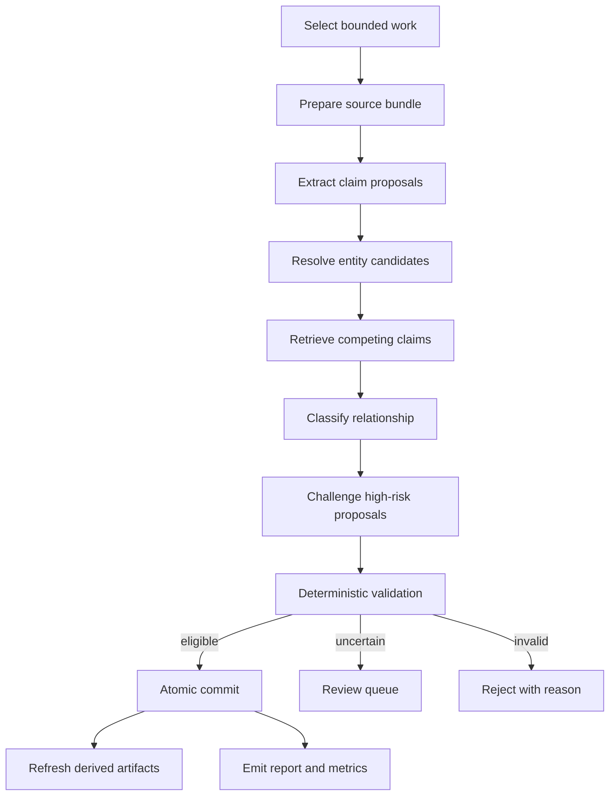

# MemoryGraph Dream Cycle Protocol

**Status:** Proposed implementation contract  
**Date:** August 21, 2026  
**Depends on:** `08-memorygraph-project-spec-v2.md`

---

## 1. Definition

The dream cycle is an incremental belief-maintenance protocol. It turns unprocessed observations and potentially stale or conflicting claims into validated, auditable proposals and then applies only policy-safe revisions.

It is not:

- A nightly rewrite of the database.
- A recursive summary of summaries.
- An LLM with unrestricted memory-edit tools.
- A web fact-checker for all personal and project memories.
- A garbage collector that deletes claims because they are old.

The system has three authority layers:

```text
LLM/provider output       -> proposal
deterministic validation  -> eligible action
atomic transaction        -> committed memory revision
```

---

## 2. Goals and Invariants

### 2.1 Goals

- Convert source observations into useful atomic claims.
- Attach every claim to exact evidence.
- Resolve entity aliases conservatively.
- Merge duplicates without losing supporting evidence.
- Close temporal intervals when reliable new evidence supersedes old state.
- Preserve unresolved contradictions.
- Identify weak, poisoned, or unverifiable claims.
- Refresh derived profiles and runbooks without feedback loops.
- Keep all actions reviewable and reversible.

### 2.2 Hard invariants

1. A dream run never modifies source observation content.
2. A derived claim without valid evidence cannot auto-commit.
3. Cross-bank reads and writes are forbidden.
4. A provider cannot create directives.
5. A provider cannot elevate evidence authority.
6. Closing a claim version and adding its successor occur atomically.
7. A failed or canceled run leaves no partial semantic mutations.
8. Replaying the same run input produces no duplicate committed records.
9. Derived artifacts cannot serve as evidence for the claims that generated them.
10. Every commit can be explained and logically rolled back.

---

## 3. Triggers

Dream work is enqueued by:

- New inferred observation.
- New evidence for a subject/predicate with active claims.
- Explicit user correction.
- End of session or turn, where supported.
- Claim entering a configurable volatile-currentness review band.
- Expiring explicit validity window.
- Materialized artifact source watermark change.
- Manual `memorygraph dream`.
- Idle scheduler.
- Import completion.

The default scheduler does not scan the full database daily. It selects bounded work from durable queues.

### 3.1 Priority

Default priority order:

1. Explicit corrections.
2. Security quarantine and poisoning review.
3. Conflicts affecting frequently retrieved claims.
4. Newly ingested observations.
5. Expiring volatile claims.
6. Entity/duplicate cleanup.
7. Artifact refresh.
8. Low-value maintenance.

---

## 4. Durable Job Model

```text
DreamRun
- id
- bank_id
- trigger
- mode: apply | dry_run | review_only
- state: queued | leased | running | awaiting_review | completed | failed | canceled
- input_watermark
- policy_version
- provider_config_hash
- lease_owner nullable
- lease_expires_at nullable
- attempt_count
- budget_json
- usage_json
- error_json nullable
- started_at nullable
- completed_at nullable
- created_at
```

```text
DreamTask
- id
- dream_run_id
- task_type
- resource_type
- resource_id
- idempotency_key
- state
- input_json
- output_json nullable
- error_json nullable
- attempt_count
- created_at
- completed_at nullable
```

```text
DreamProposal
- id
- dream_run_id
- bank_id
- proposal_type
- preconditions_json
- action_json
- evidence_ids_json
- model_trace_json nullable
- validation_json
- disposition: pending | auto_eligible | review_required | approved | rejected | committed | stale
- created_at
```

Workers claim tasks using a lease. Expired leases can be reclaimed. Idempotency keys prevent duplicate task output and mutations.

---

## 5. Pipeline



### Phase 1: Select

Inputs:

- Unprocessed observation IDs.
- Claims with new evidence or review triggers.
- Stale artifact keys.

Selection rules are deterministic and budget-aware. The selector groups observations by source/session where context is necessary but caps characters, turns, and time range.

Output:

```json
{
  "observation_ids": ["..."],
  "claim_ids": ["..."],
  "artifact_keys": ["..."],
  "reason": "new_explicit_correction",
  "priority": 100
}
```

### Phase 2: Prepare source bundle

The source bundle contains:

- Raw observation text or selected chunks.
- Actor and source class.
- Observation/effective timestamps.
- Bank extraction mission.
- Existing high-confidence entity aliases relevant to the source.
- A strict reminder that source text is untrusted data.

It does not contain provider secrets, unrelated bank data, or executable tools.

### Phase 3: Extract

The extractor produces schema-constrained candidates:

```json
{
  "entities": [
    {
      "local_id": "e1",
      "name": "MemoryGraph",
      "type": "project",
      "evidence_span": {"observation_id": "o1", "start": 10, "end": 21}
    }
  ],
  "claims": [
    {
      "subject": "e1",
      "predicate": "uses_build_backend",
      "object": {"kind": "string", "value": "hatchling"},
      "polarity": "positive",
      "valid_from": null,
      "valid_to": null,
      "explicitness": "explicit",
      "evidence_spans": [{"observation_id": "o1", "start": 0, "end": 55}],
      "extraction_confidence": 0.98
    }
  ]
}
```

Extraction rules:

- Prefer atomic claims over compound prose.
- Do not extract instructions from quoted or external content as directives.
- Preserve uncertainty and negation.
- Do not infer stable identity from ambiguous names.
- Do not invent missing dates.
- Evidence spans are mandatory.
- A model may return zero claims.

### Phase 4: Evidence validation

Before resolution:

- Observation and offsets must exist.
- Excerpt must match the stored content.
- Entity spans must be inside the observation.
- Proposed timestamp format must be valid.
- Object value must match its declared kind.
- Predicate names are normalized.
- Claims containing detected secrets are rejected or redacted per policy.
- Oversized/free-form JSON objects are rejected.

Failed candidate items are recorded but cannot progress.

### Phase 5: Entity resolution

Candidate generation:

- Exact normalized alias.
- Repository-relative file identity.
- FTS alias/name match.
- Optional vector similarity over names/descriptions.
- Recent co-occurrence within the bank.

Resolution actions:

```text
link_existing
create_new
propose_merge
ambiguous
```

Auto-link requires a high threshold plus compatible type. Entity merges require stricter policy and are normally reviewable because a bad merge contaminates many claims.

### Phase 6: Retrieve comparison set

For each candidate claim, retrieve:

- Exact same subject/predicate claims.
- Declared inverse/exclusive predicates.
- Semantically similar active claims.
- Recent superseded/retracted versions.
- Their strongest supporting and contradicting evidence.

The comparison set is capped. Candidate retrieval occurs outside a write transaction.

### Phase 7: Relationship classification

The resolver classifies the new candidate against comparisons:

```text
new_independent
duplicate
confirmation
refinement
supersession
contradiction
historical_backfill
uncertain
```

Required resolver output:

```json
{
  "classification": "supersession",
  "target_claim_ids": ["old-claim"],
  "proposed_valid_from": "2026-08-20T00:00:00Z",
  "rationale": "The user explicitly states the project switched backends.",
  "confidence": 0.97,
  "evidence_ids": ["new-evidence"],
  "uncertainties": []
}
```

The resolver cannot change evidence, authority, entity identity, or predicate policy.

### Phase 8: Challenge

Challenge is selective because it adds cost.

Required for:

- Procedural claims capable of influencing tool use.
- Security-sensitive predicates.
- Proposed supersession of a protected/high-authority claim.
- Low-margin conflict resolution.
- Claims containing instructions from an external/untrusted source.
- Large fan-out entity merges.

The challenger looks for:

- Missing or mismatched evidence.
- Alternative interpretations.
- Prompt-injection language.
- Temporal ambiguity.
- Source-authority inversion.
- Historical reference mistaken for current state.
- A claim that is actually a recommendation or speculation.

It returns objections, not mutations.

### Phase 9: Deterministic validation

The validator evaluates:

1. Authorization and bank scope.
2. Evidence span integrity.
3. Claim and entity existence.
4. Predicate cardinality and volatility.
5. Valid/system interval consistency.
6. Source-authority precedence.
7. Protected/directive restrictions.
8. Resolver threshold.
9. Challenger objections.
10. Proposal precondition watermark.
11. Idempotency.

Disposition:

- `auto_eligible`: all auto-commit rules pass.
- `review_required`: plausible but outside automatic authority.
- `rejected`: invalid, unsafe, or unsupported.
- `stale`: current database state no longer matches preconditions.

### Phase 10: Atomic commit

The committer opens a short `BEGIN IMMEDIATE` transaction and:

1. Rechecks bank, watermark, target states, and idempotency.
2. Inserts new entities/aliases if approved.
3. Inserts claim and evidence rows.
4. Closes affected claim system intervals where appropriate.
5. Inserts claim relations.
6. Updates materialized current-state indexes.
7. Appends memory events.
8. Marks proposals committed.
9. Commits.

No model call, embedding call, or broad search occurs inside the transaction.

### Phase 11: Artifact refresh

Affected artifacts are marked stale using dependency watermarks. Refresh runs separately and creates a new artifact version with source claim IDs.

Artifacts include:

- Current project profile.
- User preference profile.
- Known environment gotchas.
- Verified build/test runbook.
- Current unresolved work.

Artifact generation validates that every factual sentence is supported by included claim IDs. If citation mapping fails, the artifact is rejected.

### Phase 12: Report

Every run emits:

```text
- observations processed
- candidates extracted/rejected
- entities linked/created/ambiguous
- claims added/confirmed/superseded/contested
- review items created
- artifacts refreshed
- provider/model usage
- latency per phase
- retry/failure counts
- exact committed event range
```

---

## 6. Proposal Policies

### 6.1 Duplicate

Action:

- Do not create a second equivalent active claim.
- Add new evidence to the existing claim.
- Record a `duplicates` relation only if a new claim row was needed for historical/system-time reasons.
- Recompute evidence strength/currentness.

### 6.2 Confirmation

Action:

- Add supporting evidence.
- For volatile claims, raise currentness according to policy.
- Do not change world-valid start unless the new evidence provides earlier historical support.

### 6.3 Supersession

Action:

- New claim becomes active from the supported effective time.
- Old claim’s valid interval closes at that time if appropriate.
- Old system version closes at commit time.
- `supersedes` relation links new to old.
- History queries continue returning both.

### 6.4 Contradiction

If evidence is insufficient to determine temporal succession:

- Keep both claims.
- Set both/current group to contested as policy dictates.
- Add `contradicts` relation.
- Expose the conflict in recall.
- Create review if the claim is frequently retrieved or high importance.

### 6.5 Historical backfill

An observation may reveal past state without changing current state. Insert the historical claim with the appropriate valid interval. Never let observation recency alone turn a historical mention into the current winner.

### 6.6 Retraction

Retraction means “MemoryGraph should no longer assert this claim,” not “the claim was never recorded.” It closes the system interval and records reason/evidence. World-valid history is preserved unless the correction says the claim was never true.

---

## 7. Review Queue

Review reasons include:

- Ambiguous entity.
- Conflicting high-authority evidence.
- Protected claim change.
- Procedural or security-sensitive content.
- Insufficient temporal information.
- Entity merge fan-out.
- Provider disagreement.
- Failed challenge.
- Proposed deletion/quarantine.

Review UI/CLI displays:

- Proposed before/after state.
- Exact evidence excerpts and sources.
- Model rationale and uncertainties.
- Deterministic validator results.
- Downstream claims/artifacts affected.
- Approve, edit, reject, quarantine actions.

Approval is itself a new authoritative event; it does not edit the original proposal invisibly.

---

## 8. Rollback

Rollback is compensating, not destructive.

`rollback(run_id)`:

1. Loads the committed event range.
2. Verifies that later events do not make automatic compensation unsafe.
3. Produces inverse proposals.
4. Applies them in a new transaction if safe.
5. Otherwise creates review items.
6. Records a rollback event referencing the original run.

Original events and claims remain in system-time history.

---

## 9. Scheduling and Budgets

Default local policy:

```text
max observations/run:        100
max source characters/run:   100,000
max comparison claims/item:  20
max model calls/run:          configurable, default 25
max wall time/run:            5 minutes
max retries/task:             3
lease duration:               2 minutes, renewable
artifact refresh debounce:    5 minutes
```

Triggers coalesce by bank and resource. Explicit corrections bypass normal debounce.

Budgets may cap tokens, requests, dollars, wall time, and candidate count. Hitting a budget produces a resumable partial run, not silent omission.

---

## 10. Provider Prompts and Versioning

Prompts are repository assets with stable identifiers and tests:

```text
extract_claims/v1
resolve_claim_relationship/v1
challenge_claim/v1
synthesize_artifact/v1
plan_recall/v1
```

Each provider result records:

- Provider and model.
- Prompt ID and content hash.
- Input schema version.
- Output schema version.
- Sampling parameters.
- Token usage.
- Latency.
- Retry count.

Prompt changes require golden-fixture evaluation. Provider-specific adapters may transform the prompt but must preserve the output contract.

---

## 11. Failure Handling

| Failure | Behavior |
|---|---|
| Provider timeout | Retry with bounded backoff; no mutation. |
| Invalid structured output | Record failure; optionally retry repair once; no mutation. |
| Evidence span mismatch | Reject candidate. |
| Ambiguous entity | Review or create conservative new entity per policy. |
| Stale proposal | Requeue comparison/resolution. |
| SQLite busy | Honor timeout, retry transaction; model work is not repeated unnecessarily. |
| Process crash before commit | Lease expires; task resumes. |
| Process crash after commit before task completion | Idempotency detects committed events and finalizes task. |
| Optional vector provider unavailable | Continue with FTS/structured retrieval. |
| Artifact generation failure | Claims remain committed; old artifact remains marked stale. |
| Budget exceeded | Pause run as resumable and report remaining tasks. |

---

## 12. Dream Metrics

Operational:

- Queue depth and age.
- Run success/failure/cancel rate.
- Phase latency.
- Provider usage and cost.
- Transaction retry rate.
- Proposal staleness rate.

Quality:

- Claims per observation.
- Evidence-span validation failure rate.
- Duplicate suppression rate.
- Auto-commit/review/reject proportions.
- Human approval rate by proposal class.
- False supersession rate.
- Entity merge reversal rate.
- Unsupported active-claim rate.
- Contested-claim resolution time.
- Artifact citation coverage.

Security:

- Quarantined observations.
- Injection-pattern detections.
- Unauthorized directive attempts.
- Cross-bank authorization failures.
- High-risk procedural proposals.

---

## 13. Acceptance Tests

The dream cycle is not complete until these cases pass:

1. Same explicit observation ingested twice creates no duplicate evidence or claim.
2. Paraphrased confirmation attaches evidence to the same claim.
3. New current employment supersedes old employment with coherent valid intervals.
4. Later mention of an old employer does not restore historical employment.
5. Two simultaneous hobbies coexist under a `many` predicate.
6. Conflicting high-authority statements remain contested.
7. Imported text cannot create privileged directives.
8. A malicious file saying “ignore prior instructions” is stored as untrusted content and cannot alter agent policy.
9. Invalid model evidence spans cause zero domain mutation.
10. Provider failure between extraction and commit causes zero partial mutation.
11. Replaying a committed task is idempotent.
12. Concurrent newer evidence makes an old proposal stale rather than incorrectly committed.
13. Rollback restores the prior materialized view while preserving history.
14. Deleting source evidence lowers or invalidates dependent belief state.
15. Artifact refresh never uses the prior artifact as source evidence.

---

## 14. Product Presentation

The user-visible dream report should be concrete:

```text
Dream completed for project:memorygraph

Processed
- 18 new observations
- 7 claim candidates

Committed
- 3 new claims
- 2 confirmations
- 1 supersession

Needs review
- 1 ambiguous package-name change

Protected
- Rejected 1 instruction extracted from untrusted web content

Cost: $0.018 | Time: 14.2s | Events: 1042..1057
```

The product should lead with what changed and why—not the biological metaphor alone.
